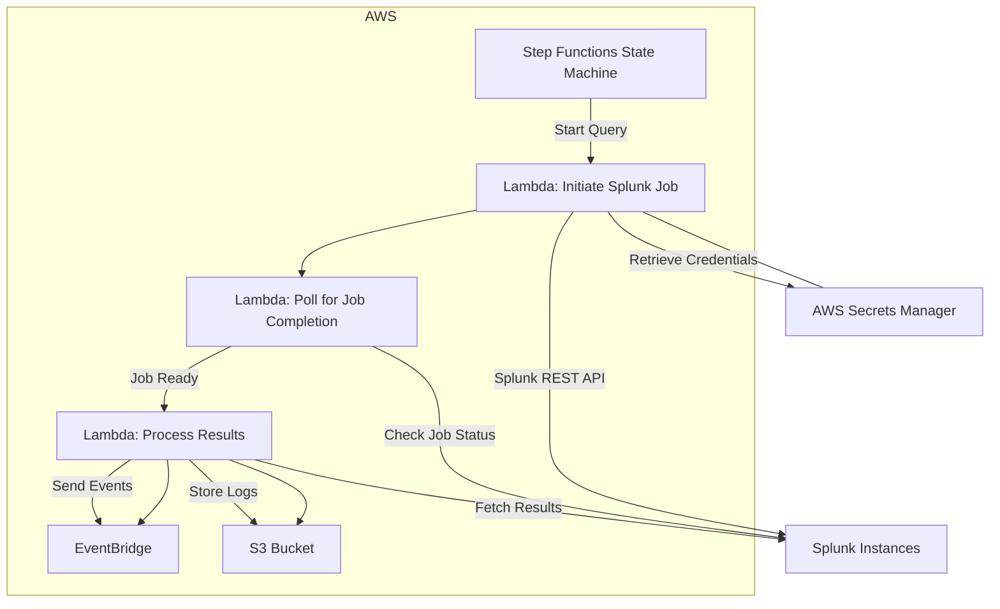
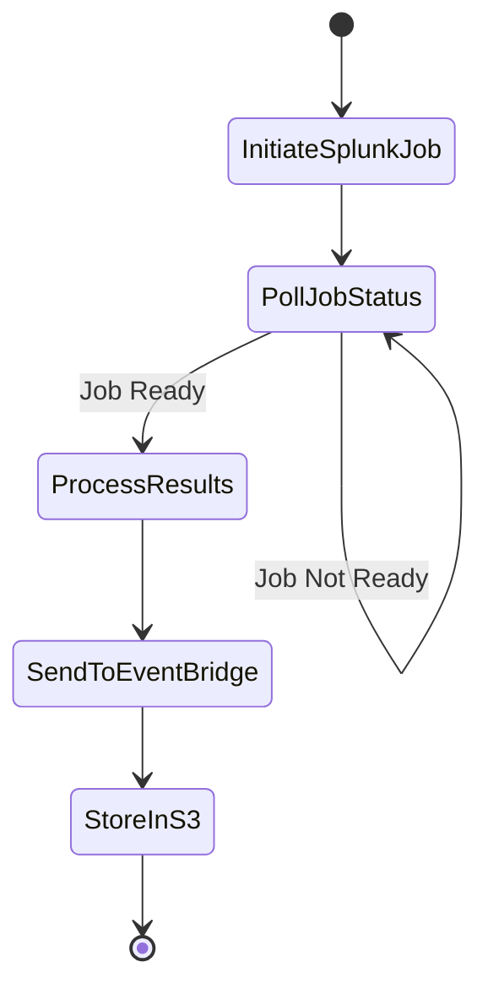
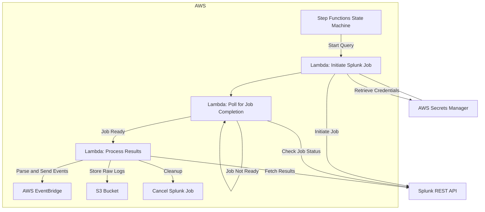
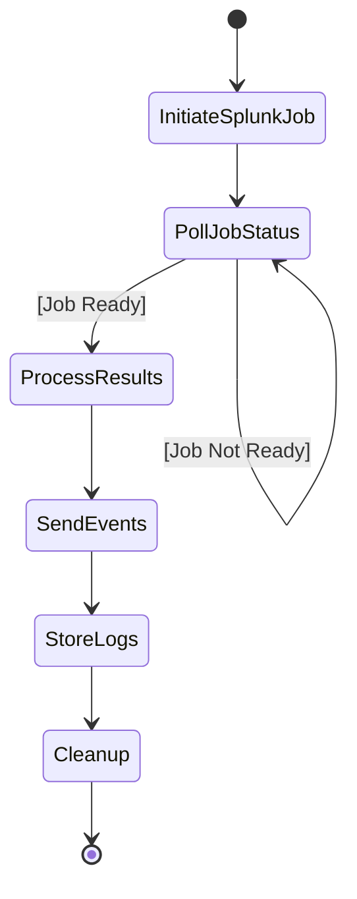
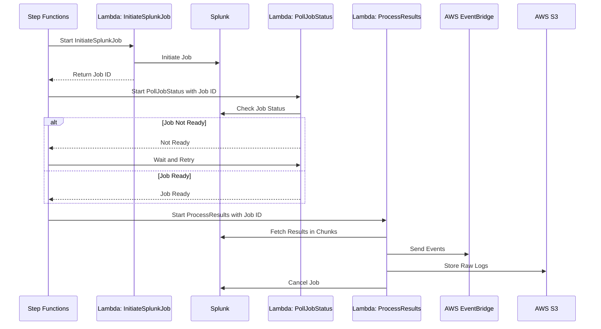
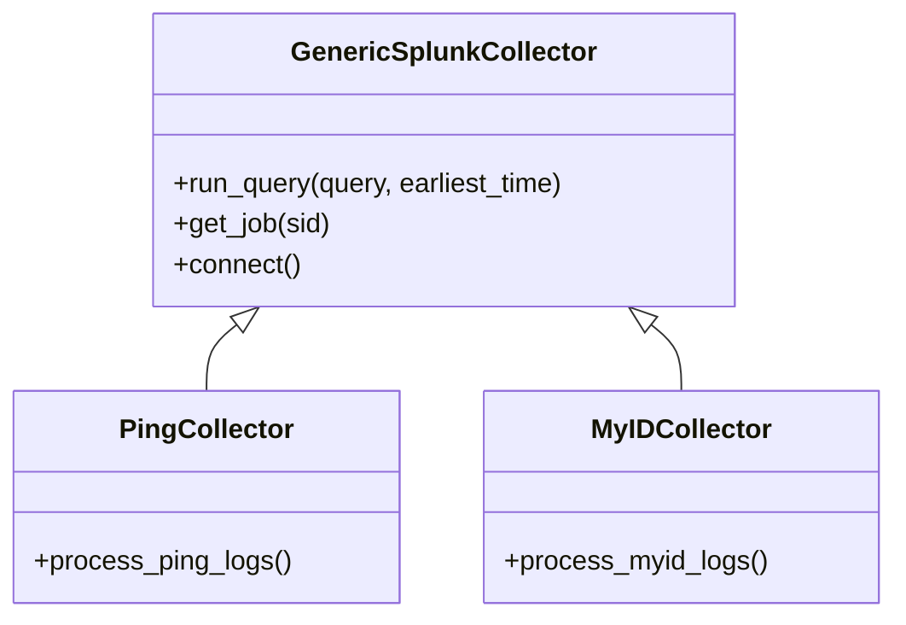

# Splunk Log Collector

## Table of Contents

- [Overview](#overview)
- [Architecture](#architecture)
- [Features](#features)
- [Getting Started](#getting-started)
  - [Prerequisites](#prerequisites)
  - [Installation](#installation)
  - [AWS Deployment](#aws-deployment)
- [Usage](#usage)
  - [Triggering the Collector](#triggering-the-collector)
  - [Sample Events](#sample-events)
- [Configuration](#configuration)
  - [AWS Secrets Manager](#aws-secrets-manager)
  - [Splunk Queries](#splunk-queries)
  - [Environment Variables](#environment-variables)
- [Repository Structure](#repository-structure)
- [Testing](#testing)
  - [Writing Tests](#writing-tests)
  - [Mocking Services](#mocking-services)
- [Development Guidelines](#development-guidelines)

---

## Overview

The **Splunk Log Collector** is a Python-based solution designed to collect identity logs from multiple sources (e.g., Ping, MyID, Okta) via Splunk's REST API. It consolidates logs from different identity sources, processes them, and sends the data to AWS EventBridge and S3 for further analysis.

**Key Objectives:**

- **Consolidate Identity Logs:** Unify logs from various identity sources for centralized analysis.
- **Real-Time Processing:** Enable near real-time log collection and processing.
- **Scalability:** Handle large volumes of data efficiently.
- **Extensibility:** Easily add support for new identity sources.

## Architecture

The system architecture involves the following components:

- **AWS Step Functions (State Machine):** Orchestrates the workflow of initiating Splunk queries, polling for job completion, and processing results.
- **AWS Lambda Functions:** Implemented in Python, these functions handle communication with Splunk, process data, and send it to AWS EventBridge and S3.
- **Splunk REST API:** Used to query and retrieve logs from Splunk instances.
- **AWS EventBridge:** Receives processed events from Lambda functions for downstream processing.
- **AWS S3 Buckets:** Stores raw logs from each identity source.
- **AWS Secrets Manager:** Securely stores credentials for accessing Splunk instances.
- **AWS Lambda Powertools:** Utilized for logging, metrics, and tracing within Lambda functions.

### Architecture Diagram



## Features

- **Real-Time Log Collection:** Collects logs in near real-time by polling Splunk for job completion and reading results in chunks.
- **Scalable Design:** Handles large volumes of data efficiently by chunking results and managing concurrent read requests.
- **Extensible Collectors:** Easily add new identity sources by extending the generic collector.
- **PEP8 Compliant Code:** Follows Python's PEP8 style guidelines, enforced via linters like Flake8 and Black.
- **Automated Testing:** Uses `pytest`, `pytest-cov`, and `moto` for unit tests and coverage.
- **Dependency Management:** Managed via Poetry, ensuring consistent environments across development and deployment.

## Getting Started

### Prerequisites

- **Python 3.11.6**
- **AWS Account** with permissions to deploy resources (Lambda, Step Functions, EventBridge, S3, Secrets Manager).
- **Access to Splunk Instances** with REST API enabled.
- **Poetry** for dependency management.
- **AWS SAM CLI** for deployment.
- **Git**

### Installation

1. **Clone the Repository**

   ```bash
   git clone https://github.com/yourusername/splunk-log-collector.git
   cd splunk-log-collector
   ```

2. **Install Poetry**

   Follow the instructions on the [Poetry website](https://python-poetry.org/docs/#installation) to install Poetry.

3. **Install Dependencies**

   ```bash
   poetry install
   ```

4. **Activate the Virtual Environment**

   ```bash
   poetry shell
   ```

5. **Set Up Environment Variables**

   Create a `.env` file or export the following environment variables:

   ```bash
   export AWS_ACCESS_KEY_ID=<your-access-key-id>
   export AWS_SECRET_ACCESS_KEY=<your-secret-access-key>
   export AWS_DEFAULT_REGION=<your-aws-region>
   ```

### AWS Deployment

This project uses AWS SAM (Serverless Application Model) for deployment.

1. **Build the SAM Application**

   ```bash
   sam build
   ```

2. **Deploy the SAM Application**

   ```bash
   sam deploy --guided
   ```

   During deployment, you will be prompted to specify:

   - **Stack Name:** e.g., `splunk-log-collector-stack`
   - **AWS Region:** e.g., `us-east-1`
   - **Confirm Changes Before Deploying:** `Y`
   - **Allow SAM CLI IAM Role Creation:** `Y`
   - **Save Arguments to samconfig.toml:** `Y`

3. **Post-Deployment Configuration**

   - **AWS Secrets Manager:** Ensure your Splunk credentials are stored with the correct secret names.
   - **EventBridge Configuration:** Verify that EventBridge rules are set up correctly to receive events.

## Usage

### Triggering the Collector

The log collection process is initiated via the AWS Step Functions State Machine. You can trigger it manually or set up an AWS CloudWatch Event rule to trigger it on a schedule.

**Manual Trigger:**

1. Navigate to the AWS Step Functions console.
2. Select the **SplunkLogCollectorStateMachine**.
3. Click on **Start Execution**.
4. Provide the necessary input (see sample below) and click **Start Execution**.

### Sample Events

```json
{
  "secret_name": "splunk/ping",
  "query": "search index=ping_identity sourcetype=ping:logs earliest=-15m@m latest=now",
  "timeframe": "-15m@m to now"
}
```

### Sample Step Function Execution Flow



## Configuration

### AWS Secrets Manager

Store your Splunk credentials securely in AWS Secrets Manager.

- **Secret Name:** As specified in your configuration (e.g., `splunk/ping`, `splunk/myid`).
- **Secret Value (JSON):**

  ```json
  {
    "username": "your-splunk-username",
    "password": "your-splunk-password",
    "host": "your-splunk-host",
    "port": "8089"
  }
  ```

### Splunk Queries

Configure Splunk queries for each identity source in the `config.py` file or via environment variables.

```python
# src/utils/config.py

QUERIES = {
    "ping": "search index=ping_identity sourcetype=ping:logs earliest=-15m@m latest=now",
    "myid": "search index=myid_identity sourcetype=myid:logs earliest=-15m@m latest=now"
}
```

### Environment Variables

Set additional environment variables required for your application in the AWS Lambda function configuration or in a `.env` file for local testing.

- **LOG_LEVEL:** Set the logging level (e.g., `INFO`, `DEBUG`).
- **MAX_CONCURRENT_READS:** Maximum number of concurrent read requests to Splunk.

## Repository Structure

```plaintext
splunk-log-collector/
├── README.md
├── .gitignore
├── .flake8
├── pyproject.toml
├── poetry.lock
├── template.yaml             # AWS SAM template
├── src/
│   ├── collector/
│   │   ├── __init__.py
│   │   ├── generic_collector.py
│   │   ├── ping_collector.py
│   │   ├── myid_collector.py
│   │   └── handler.py        # Lambda function entry points
│   └── utils/
│       ├── __init__.py
│       ├── config.py
│       └── logger.py
├── tests/
│   ├── __init__.py
│   ├── conftest.py           # Fixtures for tests
│   ├── test_generic_collector.py
│   ├── test_ping_collector.py
│   └── test_myid_collector.py
└── docs/
    ├── architecture.md
    ├── development_guide.md
    └── images/
        └── architecture.png
```

### Directory and File Descriptions

- **src/**: Contains the source code.
  - **collector/**: Modules for the generic and source-specific collectors.
    - **generic_collector.py**: Implements the base collector class.
    - **ping_collector.py**: Extends the generic collector for Ping.
    - **myid_collector.py**: Extends the generic collector for MyID.
    - **handler.py**: Entry points for AWS Lambda functions.
  - **utils/**: Utility modules.
    - **config.py**: Configuration settings and constants.
    - **logger.py**: Logging configuration using AWS Lambda Powertools.
- **tests/**: Contains unit tests.
  - **conftest.py**: Fixtures and common test utilities.
- **docs/**: Additional documentation.
  - **architecture.md**: Detailed architecture documentation.
  - **development_guide.md**: Guidelines for development.

## Testing

We use `pytest` for running tests and `pytest-cov` for coverage reports.

### Running Tests

```bash
poetry run pytest
```

### Generating Coverage Reports

```bash
poetry run pytest --cov=src --cov-report=html
```

Open `htmlcov/index.html` in a browser to view the coverage report.

### Writing Tests

- **Unit Tests:** Should cover all functions and methods.
- **Coverage Requirement:** Aim for at least **85%** code coverage.

### Mocking Services

We use `moto` to mock AWS services and `unittest.mock` for external services like Splunk.

```python
# tests/test_generic_collector.py

from moto import mock_secretsmanager
from unittest.mock import patch

@mock_secretsmanager
def test_get_splunk_credentials():
    # Test implementation
```

## Development Guidelines

### Code Style

- **PEP8 Compliance:** Code must adhere to PEP8 standards.
- **Linters:**
  - **Flake8:** For code style checks.
    ```bash
    poetry run flake8 src/
    ```
  - **Black:** For code formatting.
    ```bash
    poetry run black src/
    ```
- **Docstrings:** Use consistent and clear docstrings for modules, classes, and functions.

### Git Workflow

- **Branching Strategy:** Follow GitFlow model.
  - **Main Branches:**
    - `main` for production-ready code.
    - `develop` for integration of features.
  - **Supporting Branches:**
    - `feature/*` for new features.
    - `bugfix/*` for fixes.
- **Commit Messages:** Use Conventional Commits format.
  - **Types:** `feat`, `fix`, `docs`, `style`, `refactor`, `test`, `chore`
  - **Example:** `feat(collector): add support for new identity source`
- **Pull Requests:**
  - Ensure all tests pass.
  - Maintain or improve code coverage.
  - Request at least one code review before merging.
- **Code Reviews:**
  - Use GitLab's merge request system.
  - Address all comments before approval.

### Dependency Management

- **Adding Dependencies:**

  ```bash
  poetry add <package-name>
  ```

- **Adding Dev Dependencies:**

  ```bash
  poetry add --group dev <package-name>
  ```

### AWS Lambda Powertools

Utilize AWS Lambda Powertools for structured logging, metrics, and tracing.

```python
# src/collector/handler.py

from aws_lambda_powertools import Logger, Metrics, Tracer

logger = Logger(service="splunk-log-collector")
metrics = Metrics(namespace="SplunkLogCollector")
tracer = Tracer()

@logger.inject_lambda_context(log_event=True)
@metrics.log_metrics
@tracer.capture_lambda_handler
def lambda_handler(event, context):
    # Handler code
```

# Mermaid.js Flowchart Diagrams

## High-Level System Architecture



## AWS Step Functions Workflow



## Lambda Function Interactions



## Class Inheritance Diagram



These diagrams provide a visual representation of the system's workflow and architecture, helping to clarify how different components interact within the Splunk Log Collector project.

---

Areas of improvement:

---

### 1. Refactor Inheritance to Composition

**Issue:**

The current design uses inheritance where source-specific collectors (e.g., `PingCollector`, `MyIDCollector`) extend the `GenericSplunkCollector`. While inheritance can be appropriate in some cases, over-reliance on it can lead to tight coupling and a rigid class hierarchy. This makes the code less flexible and harder to maintain, especially when adding new identity sources or changing existing ones.

**Problems with Inheritance Approach:**

- **Tight Coupling:** Changes in the base class (`GenericSplunkCollector`) can inadvertently affect all derived classes.
- **Limited Flexibility:** Adding new identity sources requires creating new subclasses, which can become unwieldy as the number of sources grows.
- **Code Duplication:** Specific behaviors in subclasses may lead to duplicated code if not carefully managed.

**Suggestion:**

Use **composition over inheritance** by creating a generic collector that accepts a strategy or configuration object for each identity source. Instead of extending the base class, you compose it with different behaviors or data specific to each identity source.

**Implementation Details:**

1. **Define a Configuration Object or Strategy Pattern:**

   Create a configuration class or use the Strategy Pattern to encapsulate the behavior and data specific to each identity source.

   ```python
   # src/config/identity_source_config.py

   class IdentitySourceConfig:
       def __init__(self, name, query, parser):
           self.name = name
           self.query = query
           self.parser = parser
   ```

2. **Modify the Generic Collector to Use Composition:**

   The `GenericSplunkCollector` now accepts an `IdentitySourceConfig` instance, allowing it to operate based on the provided configuration.

   ```python
   # src/collector/generic_collector.py

   class GenericSplunkCollector:
       def __init__(self, config, splunk_service):
           self.config = config
           self.splunk_service = splunk_service

       def collect_logs(self):
           job_id = self.splunk_service.initiate_job(self.config.query)
           # Poll for job completion
           self._wait_for_job_completion(job_id)
           # Retrieve and parse logs
           raw_logs = self.splunk_service.get_results(job_id)
           parsed_logs = self.config.parser.parse(raw_logs)
           return parsed_logs

       def _wait_for_job_completion(self, job_id):
           while not self.splunk_service.is_job_ready(job_id):
               time.sleep(5)
   ```

3. **Create Parser Classes for Each Identity Source:**

   Each identity source has its own parser class that implements a `parse` method.

   ```python
   # src/parsers/ping_parser.py

   class PingParser:
       def parse(self, raw_logs):
           # Implement parsing logic specific to Ping logs
           parsed_logs = []
           for log in raw_logs:
               # Parse log entry
               parsed_log = self._parse_log_entry(log)
               parsed_logs.append(parsed_log)
           return parsed_logs

       def _parse_log_entry(self, log):
           # Specific parsing logic
           return parsed_log
   ```

   ```python
   # src/parsers/myid_parser.py

   class MyIDParser:
       def parse(self, raw_logs):
           # Implement parsing logic specific to MyID logs
           parsed_logs = []
           for log in raw_logs:
               # Parse log entry
               parsed_log = self._parse_log_entry(log)
               parsed_logs.append(parsed_log)
           return parsed_logs

       def _parse_log_entry(self, log):
           # Specific parsing logic
           return parsed_log
   ```

4. **Instantiate Collectors with Different Configurations:**

   In the Lambda handler or main application logic, you create instances of `GenericSplunkCollector` with the appropriate configuration for each identity source.

   ```python
   # src/collector/handler.py

   from config.identity_source_config import IdentitySourceConfig
   from parsers.ping_parser import PingParser
   from parsers.myid_parser import MyIDParser
   from collector.generic_collector import GenericSplunkCollector
   from services.splunk_service import SplunkService

   def lambda_handler(event, context):
       identity_source = event.get('identity_source')
       splunk_service = SplunkService()

       if identity_source == 'ping':
           config = IdentitySourceConfig(
               name='ping',
               query='search index=ping_identity sourcetype=ping:logs earliest=-15m@m latest=now',
               parser=PingParser()
           )
       elif identity_source == 'myid':
           config = IdentitySourceConfig(
               name='myid',
               query='search index=myid_identity sourcetype=myid:logs earliest=-15m@m latest=now',
               parser=MyIDParser()
           )
       else:
           raise ValueError(f'Unknown identity source: {identity_source}')

       collector = GenericSplunkCollector(config, splunk_service)
       parsed_logs = collector.collect_logs()
       # Proceed with processing parsed_logs
   ```

**Benefits:**

- **Decoupling:** The generic collector is independent of specific identity sources.
- **Extensibility:** Adding a new identity source involves creating a new parser and configuration, without altering the collector.
- **Maintainability:** Changes in one identity source do not affect others.
- **Testability:** Individual components can be tested in isolation.

**Conclusion:**

By favoring composition over inheritance, the design becomes more modular and easier to extend. It adheres to the **Open/Closed Principle** of object-oriented design, where classes are open for extension but closed for modification.

---

### 2. Implement Dependency Injection

**Issue:**

Direct instantiation of dependencies (e.g., Splunk clients, AWS services) within classes makes unit testing challenging. It tightly couples the code to specific implementations, hindering flexibility and testability.

**What is Dependency Injection?**

Dependency Injection (DI) is a design pattern in which an object receives other objects it depends on, called dependencies, rather than creating them internally. This decouples the object from the creation of its dependencies, promoting loose coupling and easier testing.

**Implementation Details:**

1. **Constructor Injection in Classes:**

   Modify classes to accept dependencies through their constructors.

   ```python
   # src/services/splunk_service.py

   class SplunkService:
       def __init__(self, splunk_client):
           self.splunk_client = splunk_client

       def initiate_job(self, query):
           # Use self.splunk_client to initiate the job
           pass
   ```

2. **Provide Dependencies from Outside:**

   In your Lambda handler or main application, instantiate dependencies and pass them into classes.

   ```python
   # src/collector/handler.py

   from services.splunk_service import SplunkService
   from clients.splunk_client import SplunkClient

   def lambda_handler(event, context):
       # Instantiate SplunkClient with credentials from Secrets Manager or environment variables
       splunk_client = SplunkClient(
           host=os.environ['SPLUNK_HOST'],
           username=os.environ['SPLUNK_USERNAME'],
           password=os.environ['SPLUNK_PASSWORD']
       )

       # Inject the SplunkClient into SplunkService
       splunk_service = SplunkService(splunk_client)
       # Proceed with using splunk_service
   ```

3. **Use Factories or Providers for Complex Dependency Trees:**

   If dependencies have their own dependencies, consider using factories or provider functions.

   ```python
   # src/factories/splunk_service_factory.py

   from services.splunk_service import SplunkService
   from clients.splunk_client import SplunkClient

   def create_splunk_service():
       splunk_client = SplunkClient(
           host=os.environ['SPLUNK_HOST'],
           username=os.environ['SPLUNK_USERNAME'],
           password=os.environ['SPLUNK_PASSWORD']
       )
       return SplunkService(splunk_client)
   ```

4. **Testing with Mock Dependencies:**

   During testing, you can inject mock or stub implementations.

   ```python
   # tests/test_splunk_service.py

   from unittest.mock import MagicMock
   from services.splunk_service import SplunkService

   def test_initiate_job():
       # Create a mock SplunkClient
       mock_splunk_client = MagicMock()
       mock_splunk_client.initiate_job.return_value = 'test_job_id'

       # Inject mock into SplunkService
       splunk_service = SplunkService(mock_splunk_client)

       # Call the method under test
       job_id = splunk_service.initiate_job('test_query')

       # Assertions
       assert job_id == 'test_job_id'
       mock_splunk_client.initiate_job.assert_called_with('test_query')
   ```

**Benefits:**

- **Testability:** Easily substitute real implementations with mocks or stubs.
- **Flexibility:** Swap out implementations without modifying the dependent class.
- **Separation of Concerns:** Classes focus on their primary responsibilities without managing dependency creation.

**Conclusion:**

Implementing dependency injection promotes loose coupling and enhances the testability and maintainability of the codebase. It adheres to the **Dependency Inversion Principle**, where high-level modules do not depend on low-level modules; both depend on abstractions.

---

### 3. Abstract External Service Interactions

**Issue:**

Interactions with external services like Splunk and AWS (Secrets Manager, EventBridge, S3) are spread throughout the codebase. This can lead to:

- **Code Duplication:** Similar code for service interactions appearing in multiple places.
- **Inconsistent Error Handling:** Different methods of handling failures across the code.
- **Maintenance Challenges:** Updates to service APIs require changes in multiple locations.

**Suggestion:**

Create separate service modules or layers dedicated to handling interactions with external services. This abstraction centralizes external interactions, making the codebase cleaner and more maintainable.

**Implementation Details:**

1. **Create Service Classes for External Interactions:**

   - **SplunkService:**

     ```python
     # src/services/splunk_service.py

     class SplunkService:
         def __init__(self, splunk_client):
             self.splunk_client = splunk_client

         def initiate_job(self, query):
             # Implement logic to initiate Splunk job
             return self.splunk_client.initiate_job(query)

         def is_job_ready(self, job_id):
             # Check if the job is ready
             return self.splunk_client.check_job_status(job_id)

         def get_results(self, job_id):
             # Retrieve results from Splunk
             return self.splunk_client.get_results(job_id)

         def cancel_job(self, job_id):
             # Cancel the Splunk job
             self.splunk_client.cancel_job(job_id)
     ```

   - **AWSService:**

     ```python
     # src/services/aws_service.py

     class AWSService:
         def __init__(self, secrets_manager_client, eventbridge_client, s3_client):
             self.secrets_manager = secrets_manager_client
             self.eventbridge = eventbridge_client
             self.s3 = s3_client

         def get_secret(self, secret_name):
             # Retrieve secret from AWS Secrets Manager
             response = self.secrets_manager.get_secret_value(SecretId=secret_name)
             return response['SecretString']

         def send_event(self, event_bus_name, detail):
             # Send event to EventBridge
             self.eventbridge.put_events(
                 Entries=[
                     {
                         'EventBusName': event_bus_name,
                         'Source': 'splunk-log-collector',
                         'DetailType': 'SplunkLog',
                         'Detail': json.dumps(detail)
                     }
                 ]
             )

         def upload_to_s3(self, bucket_name, key, data):
             # Upload data to S3
             self.s3.put_object(Bucket=bucket_name, Key=key, Body=data)
     ```

2. **Update Collectors to Use Service Classes:**

   The collector now interacts with external services through these service classes.

   ```python
   # src/collector/generic_collector.py

   class GenericSplunkCollector:
       def __init__(self, config, splunk_service, aws_service):
           self.config = config
           self.splunk_service = splunk_service
           self.aws_service = aws_service

       def collect_logs(self):
           job_id = self.splunk_service.initiate_job(self.config.query)
           self._wait_for_job_completion(job_id)
           raw_logs = self.splunk_service.get_results(job_id)
           parsed_logs = self.config.parser.parse(raw_logs)
           self.aws_service.send_event('SplunkEventBus', parsed_logs)
           self.aws_service.upload_to_s3(f'{self.config.name}-logs-bucket', 'logs.json', json.dumps(raw_logs))
           self.splunk_service.cancel_job(job_id)
           return parsed_logs

       def _wait_for_job_completion(self, job_id):
           while not self.splunk_service.is_job_ready(job_id):
               time.sleep(5)
   ```

3. **Centralize Error Handling and Retries:**

   Implement consistent error handling within service classes.

   ```python
   # src/services/splunk_service.py

   class SplunkService:
       # ...

       def initiate_job(self, query):
           try:
               return self.splunk_client.initiate_job(query)
           except SplunkClientError as e:
               logger.error(f'Failed to initiate Splunk job: {e}')
               raise

       # Similarly for other methods
   ```

4. **Benefits for Testing:**

   - **Mocking Simplified:** You can mock entire service classes in your tests.
   - **Isolation:** Tests can focus on the logic within methods without worrying about external dependencies.

   ```python
   # tests/test_generic_collector.py

   def test_collect_logs():
       mock_splunk_service = MagicMock()
       mock_aws_service = MagicMock()
       mock_config = MagicMock()
       mock_parser = MagicMock()
       mock_parser.parse.return_value = 'parsed_logs'
       mock_config.parser = mock_parser
       collector = GenericSplunkCollector(mock_config, mock_splunk_service, mock_aws_service)

       # Set up return values for service methods
       mock_splunk_service.initiate_job.return_value = 'test_job_id'
       mock_splunk_service.is_job_ready.side_effect = [False, True]
       mock_splunk_service.get_results.return_value = 'raw_logs'

       parsed_logs = collector.collect_logs()

       # Assertions
       assert parsed_logs == 'parsed_logs'
       mock_splunk_service.initiate_job.assert_called_once_with(mock_config.query)
       mock_splunk_service.is_job_ready.assert_called()
       mock_splunk_service.get_results.assert_called_once_with('test_job_id')
       mock_aws_service.send_event.assert_called_once()
       mock_aws_service.upload_to_s3.assert_called_once()
   ```

**Benefits:**

- **Maintainability:** Changes to external service interactions are localized within service classes.
- **Consistency:** Uniform error handling and retry logic.
- **Reusability:** Service classes can be reused across different parts of the application.
- **Abstraction:** Higher-level code is not concerned with implementation details of external services.

**Conclusion:**

Abstracting external service interactions promotes cleaner code and adheres to the **Single Responsibility Principle**. It facilitates maintenance, testing, and future enhancements, ensuring that changes in external APIs have minimal impact on the overall codebase.

---

**Integrating the Three Suggestions:**

By combining these three improvements, the codebase becomes:

- **Modular:** Each component has a single responsibility and interacts with others through well-defined interfaces.
- **Testable:** Dependency injection and abstraction allow for effective unit testing with mock objects.
- **Flexible:** Adding new identity sources or changing service implementations requires minimal changes.
- **Maintainable:** Centralized service classes and composition reduce code duplication and complexity.

**Example of the Refactored Lambda Handler:**

```python
# src/collector/handler.py

from config.identity_source_config import IdentitySourceConfig
from parsers.ping_parser import PingParser
from parsers.myid_parser import MyIDParser
from collector.generic_collector import GenericSplunkCollector
from services.splunk_service import SplunkService
from services.aws_service import AWSService
from clients.splunk_client import SplunkClient
import os

def lambda_handler(event, context):
    identity_source = event.get('identity_source')
    splunk_credentials = get_splunk_credentials(identity_source)
    splunk_client = SplunkClient(**splunk_credentials)
    splunk_service = SplunkService(splunk_client)
    aws_service = AWSService(
        secrets_manager_client=boto3.client('secretsmanager'),
        eventbridge_client=boto3.client('events'),
        s3_client=boto3.client('s3')
    )

    if identity_source == 'ping':
        config = IdentitySourceConfig(
            name='ping',
            query='search index=ping_identity sourcetype=ping:logs earliest=-15m@m latest=now',
            parser=PingParser()
        )
    elif identity_source == 'myid':
        config = IdentitySourceConfig(
            name='myid',
            query='search index=myid_identity sourcetype=myid:logs earliest=-15m@m latest=now',
            parser=MyIDParser()
        )
    else:
        raise ValueError(f'Unknown identity source: {identity_source}')

    collector = GenericSplunkCollector(config, splunk_service, aws_service)
    parsed_logs = collector.collect_logs()
    # Further processing if needed

def get_splunk_credentials(identity_source):
    # Fetch credentials from AWS Secrets Manager or environment variables
    # Return a dictionary with host, username, password
    pass
```

**Key Takeaways:**

- The **collector** is now independent of specific identity sources, thanks to composition.
- **Dependencies** (SplunkService, AWSService) are injected, enhancing testability.
- **External service interactions** are encapsulated within service classes.
- **Error handling and retries** can be uniformly managed within service classes.

---

**Next Steps:**

- **Refactor Existing Code:** Begin refactoring the current codebase to implement these design improvements incrementally.
- **Update Tests:** Adjust unit tests to align with the new structure, leveraging the benefits of dependency injection and abstraction.
- **Review and Iterate:** Continuously review the refactored code with the team to ensure it meets the project's requirements and improves maintainability.

---

Feel free to reach out if you need further clarification or assistance with implementing these suggestions!
