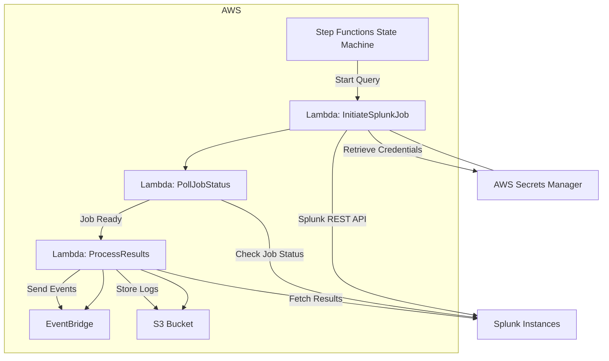
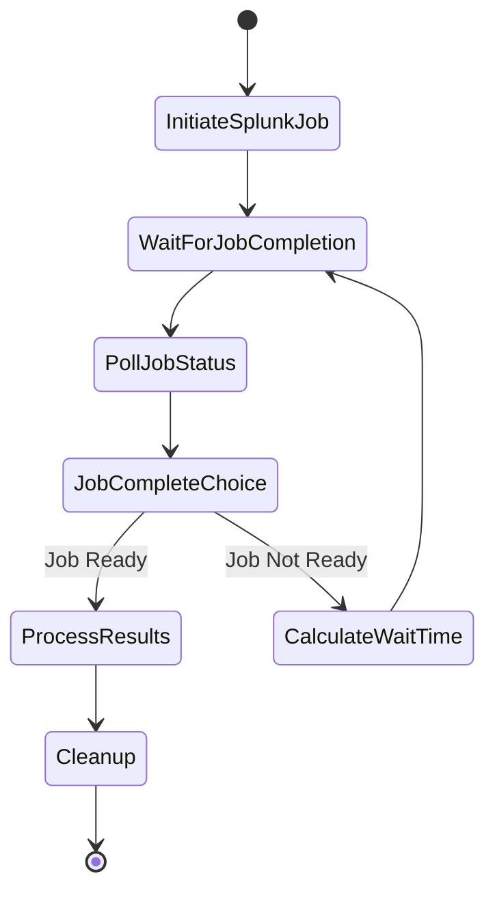
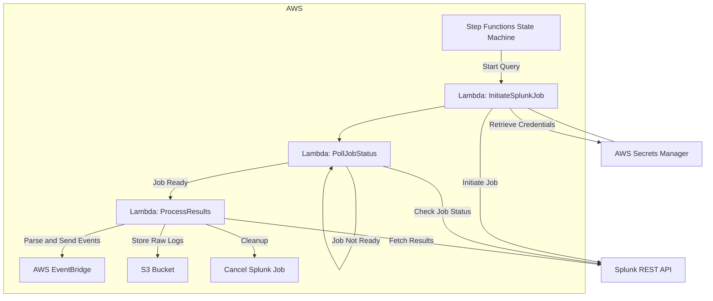
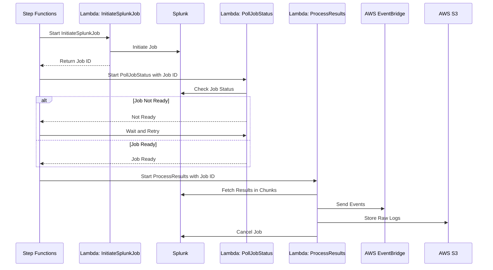
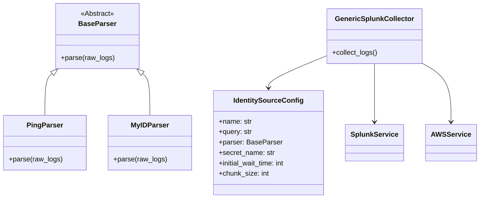

# Splunk Log Collector

[](https://www.python.org/)
[](https://aws.amazon.com/serverless/sam/)
[](#)

The **Splunk Log Collector** is a robust, scalable, and extensible Python-based solution designed to aggregate identity logs from multiple sources (e.g., Ping, MyID, Okta) using Splunk's REST API. It consolidates logs from different identity sources, processes them, and sends the data to AWS EventBridge and S3 for centralized, near real-time analysis.

---

## Table of Contents

- [Overview](#overview)
- [Architecture](#architecture)
  - [Architecture Diagram](#architecture-diagram)
- [Features](#features)
- [Technologies Used](#technologies-used)
- [Getting Started](#getting-started)
  - [Prerequisites](#prerequisites)
  - [Installation](#installation)
  - [AWS Deployment](#aws-deployment)
- [Usage](#usage)
  - [Triggering the Collector](#triggering-the-collector)
  - [Sample Events](#sample-events)
  - [Sample Step Function Execution Flow](#sample-step-function-execution-flow)
- [Configuration](#configuration)
  - [AWS Secrets Manager](#aws-secrets-manager)
  - [Splunk Queries](#splunk-queries)
  - [Environment Variables](#environment-variables)
- [Repository Structure](#repository-structure)
  - [Directory and File Descriptions](#directory-and-file-descriptions)
- [Testing](#testing)
  - [Running Tests](#running-tests)
  - [Generating Coverage Reports](#generating-coverage-reports)
  - [Writing Tests](#writing-tests)
  - [Mocking Services](#mocking-services)
- [Development Guidelines](#development-guidelines)
  - [Code Style](#code-style)
  - [Git Workflow](#git-workflow)
  - [Dependency Management](#dependency-management)
  - [AWS Lambda Powertools](#aws-lambda-powertools)
- [Deep Dive into the Splunk Log Collector](#deep-dive-into-the-splunk-log-collector)
  - [High-Level Architecture](#high-level-architecture)
  - [Detailed Component Breakdown](#detailed-component-breakdown)
  - [Data Flow Details](#data-flow-details)
  - [Implemented Improvements](#implemented-improvements)
- [Mermaid.js Diagrams](#mermaidjs-diagrams)
  - [High-Level System Architecture](#high-level-system-architecture)
  - [AWS Step Functions Workflow](#aws-step-functions-workflow)
  - [Lambda Function Interactions](#lambda-function-interactions)
  - [Class Composition Diagram](#class-composition-diagram)

---

## Overview

The **Splunk Log Collector** streamlines the collection of identity logs from multiple sources using Splunk's REST API. By consolidating logs from various identity sources, it enables centralized analysis and real-time processing, enhancing scalability and ease of adding new identity sources.

**Key Objectives:**

- **Consolidate Identity Logs:** Unify logs from various identity sources for centralized analysis.
- **Real-Time Processing:** Enable near real-time log collection and processing.
- **Scalability:** Efficiently handle large volumes of data.
- **Extensibility:** Easily add support for new identity sources.

## Architecture

The system leverages AWS services to orchestrate, process, and store log data efficiently, ensuring scalability and reliability suitable for large enterprises.

- **AWS Step Functions (State Machine):** Orchestrates the workflow of initiating Splunk queries, polling for job completion, and processing results.
- **AWS Lambda Functions:** Handle communication with Splunk, process data, and interact with AWS services.
- **Splunk REST API:** Used to execute searches and retrieve results from Splunk instances.
- **AWS EventBridge:** Receives processed events from Lambda functions for downstream processing.
- **AWS S3 Buckets:** Stores raw logs from each identity source.
- **AWS Secrets Manager:** Securely stores credentials for accessing Splunk instances.
- **AWS Lambda Powertools:** Utilized for logging, metrics, and tracing within Lambda functions.
- **Configuration and Parser Modules:** Use composition over inheritance for managing identity sources.

### Architecture Diagram



## Features

- **Real-Time Log Collection:** Collect logs in near real-time by polling Splunk for job completion and reading results in chunks.
- **Scalable Design:** Efficiently handle large volumes of data by chunking results and managing concurrent read requests.
- **Extensible Collectors:** Easily add new identity sources using composition over inheritance.
- **Robust Error Handling:** Enhanced fault tolerance and reliability with comprehensive error handling.
- **Comprehensive Observability:** Improved logging, metrics, and tracing for monitoring.
- **PEP8 Compliant Code:** Follows Python's PEP8 style guidelines, enforced via linters like Flake8 and Black.
- **Automated Testing:** Uses `pytest`, `pytest-cov`, and `moto` for unit tests and coverage.
- **Dependency Management:** Managed via Poetry, ensuring consistent environments across development and deployment.

## Technologies Used

- **Python 3.11.6**
- **AWS Lambda**
- **AWS Step Functions**
- **AWS EventBridge**
- **AWS S3**
- **AWS Secrets Manager**
- **AWS Lambda Powertools**
- **Splunk REST API**
- **Poetry** for dependency management
- **AWS SAM CLI** for deployment
- **Pytest** for testing
- **Moto** for mocking AWS services
- **Flake8** and **Black** for code style and formatting

## Getting Started

### Prerequisites

- **Python 3.11.6**
- **AWS Account** with permissions to deploy resources.
- **Access to Splunk Instances** with REST API enabled.
- **Poetry** for dependency management.
- **AWS SAM CLI** for deployment.
- **Git**

### Installation

1. **Clone the Repository**

   ```bash
   git clone https://github.com/yourusername/splunk-log-collector.git
   cd splunk-log-collector
   ```

2. **Install Poetry**

   Follow the instructions on the [Poetry website](https://python-poetry.org/docs/#installation) to install Poetry.

3. **Install Dependencies**

   ```bash
   poetry install
   ```

4. **Activate the Virtual Environment**

   ```bash
   poetry shell
   ```

5. **Set Up Environment Variables**

   Create a `.env` file or export the following environment variables:

   ```bash
   export AWS_ACCESS_KEY_ID=<your-access-key-id>
   export AWS_SECRET_ACCESS_KEY=<your-secret-access-key>
   export AWS_DEFAULT_REGION=<your-aws-region>
   ```

### AWS Deployment

This project uses AWS SAM (Serverless Application Model) for deployment.

1. **Build the SAM Application**

   ```bash
   sam build
   ```

2. **Deploy the SAM Application**

   ```bash
   sam deploy --guided
   ```

   During deployment, you will be prompted to specify:

   - **Stack Name:** e.g., `splunk-log-collector-stack`
   - **AWS Region:** e.g., `us-east-1`
   - **Confirm Changes Before Deploying:** `Y`
   - **Allow SAM CLI IAM Role Creation:** `Y`
   - **Save Arguments to samconfig.toml:** `Y`

3. **Post-Deployment Configuration**

   - **AWS Secrets Manager:** Ensure your Splunk credentials are stored with the correct secret names.
   - **EventBridge Configuration:** Verify that EventBridge rules are set up correctly to receive events.

## Usage

### Triggering the Collector

The log collection process is initiated via the AWS Step Functions State Machine. You can trigger it manually or set up an AWS CloudWatch Events rule to trigger it on a schedule.

**Manual Trigger:**

1. Navigate to the AWS Step Functions console.
2. Select the **SplunkLogCollectorStateMachine**.
3. Click on **Start Execution**.
4. Provide the necessary input (see sample below) and click **Start Execution**.

### Sample Events

```json
{
  "identity_source": "ping",
  "query": "search index=ping_identity sourcetype=ping:logs earliest=-15m@m latest=now"
}
```

### Sample Step Function Execution Flow



## Configuration

### AWS Secrets Manager

Store your Splunk credentials securely in AWS Secrets Manager.

- **Secret Name:** As specified in your configuration (e.g., `splunk/ping`, `splunk/myid`).
- **Secret Value (JSON):**

  ```json
  {
    "username": "your-splunk-username",
    "password": "your-splunk-password",
    "host": "your-splunk-host",
    "port": "8089"
  }
  ```

### Splunk Queries

Configure Splunk queries for each identity source in the `config.py` file or via environment variables.

```python
# src/config/identity_source_config.py

IDENTITY_SOURCE_CONFIGS = {
    "ping": IdentitySourceConfig(
        name="ping",
        query="search index=ping_identity sourcetype=ping:logs earliest=-15m@m latest=now",
        parser=PingParser(),
        secret_name="splunk/ping"
    ),
    "myid": IdentitySourceConfig(
        name="myid",
        query="search index=myid_identity sourcetype=myid:logs earliest=-15m@m latest=now",
        parser=MyIDParser(),
        secret_name="splunk/myid"
    )
}
```

### Environment Variables

Set additional environment variables required for your application in the AWS Lambda function configuration or in a `.env` file for local testing.

- **LOG_LEVEL:** Set the logging level (e.g., `INFO`, `DEBUG`).
- **S3_BUCKET_NAME:** Name of the S3 bucket for storing logs.
- **MAX_CONCURRENT_READS:** Maximum number of concurrent read requests to Splunk.

## Repository Structure

```plaintext
splunk-log-collector/
├── README.md
├── .gitignore
├── .flake8
├── pyproject.toml
├── poetry.lock
├── template.yaml             # AWS SAM template
├── src/
│   ├── collector/
│   │   ├── __init__.py
│   │   ├── generic_collector.py
│   │   ├── handler.py        # Lambda function entry points
│   ├── config/
│   │   ├── __init__.py
│   │   └── identity_source_config.py
│   ├── parsers/
│   │   ├── __init__.py
│   │   ├── base_parser.py
│   │   ├── ping_parser.py
│   │   └── myid_parser.py
│   ├── services/
│   │   ├── __init__.py
│   │   ├── aws_service.py
│   │   └── splunk_service.py
│   ├── utils/
│   │   ├── __init__.py
│   │   ├── logger.py
│   │   └── helpers.py
├── tests/
│   ├── __init__.py
│   ├── conftest.py           # Fixtures for tests
│   ├── test_generic_collector.py
│   ├── test_parsers.py
│   ├── test_services.py
│   └── test_handlers.py
└── docs/
    ├── architecture.md
    ├── development_guide.md
    └── images/
        └── architecture.png
```

### Directory and File Descriptions

- **`src/`**: Contains the source code.
  - **`collector/`**: Modules for the generic collector and Lambda handlers.
    - **`generic_collector.py`**: Implements the collector using composition.
    - **`handler.py`**: Entry points for AWS Lambda functions.
  - **`config/`**: Configuration modules.
    - **`identity_source_config.py`**: Defines configurations for identity sources.
  - **`parsers/`**: Parser modules for different identity sources.
    - **`base_parser.py`**: Base parser interface.
    - **`ping_parser.py`**: Parser for Ping identity logs.
    - **`myid_parser.py`**: Parser for MyID identity logs.
  - **`services/`**: Service modules for external interactions.
    - **`splunk_service.py`**: Handles interactions with Splunk REST API.
    - **`aws_service.py`**: Manages AWS service interactions (EventBridge, S3).
  - **`utils/`**: Utility modules.
    - **`logger.py`**: Logging configuration using AWS Lambda Powertools.
    - **`helpers.py`**: Helper functions.
- **`tests/`**: Contains unit tests.
  - **`conftest.py`**: Fixtures and common test utilities.
- **`docs/`**: Additional documentation.
  - **`architecture.md`**: Detailed architecture documentation.
  - **`development_guide.md`**: Guidelines for development.

## Testing

We use `pytest` for running tests and `pytest-cov` for coverage reports.

### Running Tests

```bash
poetry run pytest
```

### Generating Coverage Reports

```bash
poetry run pytest --cov=src --cov-report=html
```

Open `htmlcov/index.html` in a browser to view the coverage report.

### Writing Tests

- **Unit Tests:** Should cover all functions and methods.
- **Coverage Requirement:** Aim for at least **85%** code coverage.

### Mocking Services

We use `moto` to mock AWS services and `unittest.mock` for external services like Splunk.

```python
# tests/test_splunk_service.py

from moto import mock_secretsmanager
from unittest.mock import MagicMock

@mock_secretsmanager
def test_initiate_job():
    # Test implementation
```

## Development Guidelines

### Code Style

- **PEP8 Compliance:** Code must adhere to PEP8 standards.
- **Linters:**
  - **Flake8:** For code style checks.

    ```bash
    poetry run flake8 src/
    ```

  - **Black:** For code formatting.

    ```bash
    poetry run black src/
    ```

- **Docstrings:** Use consistent and clear docstrings for modules, classes, and functions.

### Git Workflow

- **Branching Strategy:** Follow GitFlow model.
  - **Main Branches:**
    - `main` for production-ready code.
    - `develop` for integration of features.
  - **Supporting Branches:**
    - `feature/*` for new features.
    - `bugfix/*` for fixes.
- **Commit Messages:** Use Conventional Commits format.
  - **Types:** `feat`, `fix`, `docs`, `style`, `refactor`, `test`, `chore`
  - **Example:** `feat(collector): add support for new identity source`
- **Pull Requests:**
  - Ensure all tests pass.
  - Maintain or improve code coverage.
  - Request at least one code review before merging.
- **Code Reviews:**
  - Use GitHub's pull request system.
  - Address all comments before approval.

### Dependency Management

- **Adding Dependencies:**

  ```bash
  poetry add <package-name>
  ```

- **Adding Dev Dependencies:**

  ```bash
  poetry add --group dev <package-name>
  ```

### AWS Lambda Powertools

Utilize AWS Lambda Powertools for structured logging, metrics, and tracing.

```python
# src/collector/handler.py

from aws_lambda_powertools import Logger, Metrics, Tracer

logger = Logger(service="splunk-log-collector")
metrics = Metrics(namespace="SplunkLogCollector")
tracer = Tracer()

@logger.inject_lambda_context(log_event=True)
@metrics.log_metrics
@tracer.capture_lambda_handler
def lambda_handler(event, context):
    # Handler code
```

## Deep Dive into the Splunk Log Collector

### High-Level Architecture

The system is designed to handle large volumes of data efficiently, ensuring scalability and reliability suitable for a Fortune 10 company. It leverages AWS services to orchestrate and process data, incorporating best practices for high performance and maintainability.

- **Initiation:** The process starts via a scheduled trigger or manually, initiating the AWS Step Functions state machine.
- **Splunk Job Initiation:** A Lambda function starts a Splunk search job using the provided query and identity source configuration.
- **Job Polling:** Employs an adaptive polling mechanism with exponential backoff to efficiently check the job status.
- **Result Processing:** Upon job completion, a Lambda function retrieves results in manageable chunks, processes the logs using source-specific parsers, and prepares them for downstream consumption.
- **Data Forwarding:** Processed logs are sent to AWS EventBridge, and raw logs are stored in AWS S3, both optimized for high throughput.
- **Cleanup:** The Splunk job is canceled to release resources.
- **Observability:** Comprehensive logging, metrics, and tracing are implemented for monitoring and troubleshooting.

### Detailed Component Breakdown

- **AWS Step Functions State Machine:** Orchestrates the sequence of Lambda functions, managing retries, error handling, and the overall workflow.
- **AWS Lambda Functions:** Perform specific tasks such as initiating Splunk jobs, polling for job completion, processing results, and interacting with AWS services.
- **Splunk REST API Interaction:** Facilitates communication with Splunk for job management and data retrieval.
- **AWS Secrets Manager:** Securely stores and retrieves credentials needed to access Splunk instances.
- **AWS EventBridge:** Acts as an event bus to route processed log events to downstream systems efficiently.
- **AWS S3:** Stores raw logs for archival, with optimized storage patterns for performance.
- **Configuration and Parser Modules:** Manages identity source configurations and parsing logic using composition over inheritance.
- **Observability Enhancements:** Provides comprehensive logging, metrics, and tracing for monitoring and troubleshooting.

### Data Flow Details

1. **Initiating a Splunk Search Job:** Optimized queries are used for faster execution.
2. **Polling for Job Completion:** Adaptive polling with exponential backoff reduces unnecessary API calls.
3. **Retrieving and Processing Results:** Results are fetched in chunks, and logs are transformed using source-specific parsers.
4. **Sending Events to EventBridge:** Events are batched and sent efficiently.
5. **Storing Raw Logs in S3:** Logs are compressed and stored using optimized storage patterns.

### Implemented Improvements

- **Scalability Enhancements:** Chunked processing, concurrency, and resource optimization.
- **Efficiency in Polling Mechanism:** Adaptive polling and optimized Splunk queries.
- **Simplifying Addition of New Identity Sources:** Composition over inheritance and configuration files.
- **Optimizing AWS EventBridge and S3 Usage:** Data payload optimization and batching.
- **Enhanced Error Handling and Fault Tolerance:** Robust exception handling and retries.
- **Reducing Latency in Multi-Step Processing:** Workflow optimization and asynchronous processing.
- **Improved Observability and Monitoring:** Structured logging, custom metrics, and distributed tracing.
- **Data Ordering and Consistency:** Sequence numbers and timestamps included in events.

---

## Mermaid.js Diagrams

### High-Level System Architecture



### AWS Step Functions Workflow


### Lambda Function Interactions



### Class Composition Diagram



---

Feel free to explore the diagrams and code snippets for a better understanding of the system's workflow and architecture.
